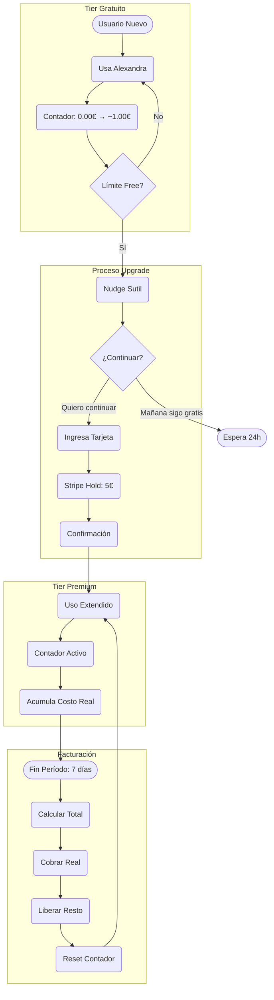

# MONETIZATION v2: Alexandra Tours

> Sistema de monetización sostenible sin arruinar la magia
> Actualizado Enero 2026

---

## 1. El Problema

| Factor | Impacto |
|--------|---------|
| Costo por mensaje LLM | ~0.02€ |
| Volumen esperado | Alto (turistas curiosos) |
| Presupuesto fundador | Limitado (~400€/mes máx) |
| Comisiones Stripe por transacción | 0.25€ + 1.4% |

**Si cobramos por mensaje:** Las comisiones nos comen vivos
**Si es gratis:** Nos arruinamos

---

## 2. La Solución: Contador Acumulativo

### Concepto
```
Mensaje 1 → +0.02€ al contador
Mensaje 2 → +0.02€ al contador
...
Mensaje 50 → +0.02€ al contador
═══════════════════════════════
Total período: 1.00€
Transacción ÚNICA al final
```

**Una sola comisión de Stripe, no 50.**

---

## 3. Flujo Completo



---

## 4. Tiers Detallados

### Free Tier

| Aspecto | Valor |
|---------|-------|
| Costo para usuario | 0€ |
| Límite | ~50 interacciones equivalentes (~1€ costo nuestro) |
| Reinicio | **NO diario** - Persistente |
| Memoria | Sí, reconoce al usuario |
| Experiencia | Básica pero útil |

**Propósito:** Demostrar valor, generar confianza

---

### Premium Tier

| Aspecto | Valor |
|---------|-------|
| Activación | **Hold de 10€** en tarjeta |
| Cobro | Solo lo consumido (fin de período) |
| Período | 7 días |
| Límite | Sin límite artificial (~500 interacciones/semana máx) |
| Memoria | Completa + preferencias |
| Experiencia | Acompañamiento extendido |

**Propósito:** Relación sostenible

**Por qué 10€ y no 5€:**
- Turista en Barcelona gasta 100-300€/día, 10€ es imperceptible
- Cubre uso extremo (500 interacciones = ~10€)
- Más margen de seguridad financiera para el fundador

---

## 5. Implementación Stripe

### Hold (Pre-autorización)

```python
# Crear PaymentIntent con capture_method=manual
intent = stripe.PaymentIntent.create(
    amount=1000,  # 10€ en céntimos
    currency='eur',
    capture_method='manual',  # NO cobra, solo retiene
    customer=customer_id,
    metadata={
        'session_id': session_id,
        'tier': 'premium',
        'hold_date': datetime.now().isoformat()
    }
)
```

### Cobro Final (Capture parcial)

```python
# Al final del período, cobrar solo lo usado
actual_usage = get_usage_for_period(session_id)  # ej: 2.40€

stripe.PaymentIntent.capture(
    intent_id,
    amount_to_capture=int(actual_usage * 100)  # 240 céntimos
)
# Los 2.60€ restantes se liberan automáticamente
```

---

## 6. UX del Upgrade

### Pantalla de Upgrade (NO agresiva)

```
┌─────────────────────────────────────────┐
│                                         │
│  Alexandra puede acompañarte más        │
│                                         │
│  Retenemos 10€ de tu tarjeta.           │
│  Solo pagas lo que uses.                │
│                                         │
│  Ejemplo: Si usas 3.20€ esta semana,    │
│  eso es lo que se cobra.                │
│                                         │
│  ┌─────────────────────────────────┐    │
│  │ Continuar con tarjeta          │    │
│  └─────────────────────────────────┘    │
│                                         │
│  ┌─────────────────────────────────┐    │
│  │ Mejor mañana (sigo gratis)     │    │
│  └─────────────────────────────────┘    │
│                                         │
└─────────────────────────────────────────┘
```

---

## 7. Cálculo de Costos DETALLADO

### Por Llamada a API (Tracking Real)

| Servicio | Endpoint/Acción | Costo Estimado | Notas |
|----------|-----------------|----------------|-------|
| **ElevenLabs** | TTS (voz) | ~0.006€/mensaje | ~150 chars promedio |
| **ElevenLabs** | STT (transcripción) | ~0.002€/mensaje | Incluido en plan |
| **Claude** | Sonnet (via 11Labs) | ~0.008€/mensaje | ~500 tokens avg |
| **OpenWeather** | Clima actual | ~0.0001€/call | 1M calls/mes free |
| **Google Maps** | Directions | ~0.005€/call | Solo cuando pide ruta |
| **Google Places** | Details | ~0.017€/call | Solo cuando profundiza |
| **Cache Hit** | Respuesta cacheada | 0€ | Objetivo: 50%+ hits |

### Costo Por Tipo de Interacción

| Tipo | Componentes | Costo Total |
|------|-------------|-------------|
| **Saludo/Despedida** | TTS only (bypass LLM) | ~0.006€ |
| **Pregunta simple** | TTS + STT + Cache hit | ~0.008€ |
| **Recomendación** | TTS + STT + Claude + Weather | ~0.018€ |
| **Itinerario** | TTS + STT + Claude + Maps + Places | ~0.040€ |
| **Promedio ponderado** | - | **~0.02€** |

### Sistema de Tracking Visible al Usuario

```
┌─────────────────────────────────────────┐
│  Tu consumo esta semana                 │
│                                         │
│  ████████████░░░░░░░░  1.67€ / 10€      │
│                                         │
│  32 conversaciones                      │
│  Última: hace 2 horas                   │
│                                         │
│  [Ver detalle]                          │
└─────────────────────────────────────────┘
```

**El usuario VE su consumo real en tiempo real.**

---

## 8. Análisis de Riesgo Financiero (CRÍTICO)

### Escenario: 400 Llaveros NFC

| Variable | Valor |
|----------|-------|
| Llaveros distribuidos | 400 |
| Presupuesto máximo mensual | 400€ |
| Costo free tier por usuario | ~0.60€ (30 interacciones) |

### Proyecciones

| Escenario | Usuarios Activos | Costo Free | Conversión | Premium | Ingreso | Balance |
|-----------|------------------|------------|------------|---------|---------|---------|
| Pesimista | 400 (100%) | 240€ | 5% | 20 | ~40€ | **-200€** |
| Realista | 300 (75%) | 180€ | 10% | 30 | ~60€ | **-120€** |
| Optimista | 200 (50%) | 120€ | 15% | 30 | ~90€ | **-30€** |

### Estrategia Recomendada: Lanzamiento Escalonado

```
FASE 1 (Mes 1-2): 100 llaveros
├── Costo máximo: 60€
├── Objetivo: 15+ conversiones
├── Si <10%: Iterar producto
└── Si >15%: Escalar

FASE 2 (Mes 3-4): 200 llaveros
├── Costo máximo: 120€
├── Objetivo: 30+ conversiones
└── Validar unit economics

FASE 3 (Mes 5+): 400 llaveros
├── Solo si conversión >12%
└── Con datos reales de LTV
```

### Por Usuario Free (AJUSTADO)

| Métrica | Valor Anterior | Valor Nuevo |
|---------|----------------|-------------|
| Interacciones permitidas | ~50 | **~30** |
| Costo total | ~1€ | **~0.60€** |
| Conversión necesaria | 10% | **12%** |

### Por Usuario Premium (semana)

| Escenario | Interacciones | Costo | Hold | Margen |
|-----------|---------------|-------|------|--------|
| Light | 30 | 0.60€ | 10€ | 9.40€ buffer |
| Medium | 100 | 2€ | 10€ | 8€ buffer |
| Heavy | 300 | 6€ | 10€ | 4€ buffer |
| Extreme | 500 | 10€ | 10€ | 0€ (límite) |

**Hold de 10€** cubre hasta ~500 interacciones/semana (uso extremo).

---

## 9. Implementación: Tracking de Costos

### Backend: Modelo de Datos

```python
class UsageLog:
    session_id: str
    timestamp: datetime
    service: str  # "elevenlabs", "claude", "weather", "maps"
    action: str   # "tts", "stt", "completion", "directions"
    cost_cents: int  # Costo en céntimos (evita floats)
    cached: bool  # Si fue cache hit

class SessionUsage:
    session_id: str
    period_start: datetime
    total_cost_cents: int
    interaction_count: int
    breakdown: dict  # {"elevenlabs": 45, "claude": 80, ...}
```

### API Endpoint

```python
@router.get("/api/usage/{session_id}")
def get_usage(session_id: str):
    return {
        "total_cost_eur": 1.67,
        "interaction_count": 32,
        "period_start": "2026-01-25",
        "period_end": "2026-02-01",
        "hold_amount": 10.00,
        "remaining": 8.33,
        "breakdown": {
            "voice": 0.52,
            "intelligence": 0.98,
            "context": 0.17
        }
    }
```

### Frontend: Componente de Uso

```javascript
// Mostrar después de cada interacción (sutil)
function updateUsageIndicator(usage) {
    const percent = (usage.total_cost_eur / usage.hold_amount) * 100;
    indicator.style.width = `${percent}%`;
    indicator.title = `${usage.total_cost_eur.toFixed(2)}€ de ${usage.hold_amount}€`;
}
```

---

## 8. Camino a Rentabilidad

### Fase 1: Validación (Actual)
- Objetivo: 50 usuarios premium activos
- Margen: ~0% (cubrir costos)
- Propósito: Demostrar tracción

### Fase 2: Optimización
- Mejorar cache hit rate (40% → 60%)
- Reducir costo por interacción (0.02€ → 0.012€)
- Margen: 20-30%

### Fase 3: Escala
- Negociar precios por volumen (ElevenLabs, Claude)
- Añadir revenue streams (afiliados, B2B)
- Margen: 40-50%

---

## 9. Lightning Network (Futuro)

### Por qué NO ahora

| Barrera | Impacto |
|---------|---------|
| Fiscalidad cripto España | Requiere abogado especializado |
| LLC USA + Residencia España | Complejidad doble |
| UX para usuario promedio | Fricción alta |
| Volatilidad | Riesgo de precio |

### Cuándo sí

- Después de validar con Stripe
- Con asesoría legal clara
- Cuando LN UX mejore (2027+?)
- Como **opción adicional**, no reemplazo

### Ventajas futuras

| Ventaja | Descripción |
|---------|-------------|
| Comisiones ~0 | vs 1.4% + 0.25€ Stripe |
| Sin intermediarios | Pago directo |
| Privacidad | Sin datos de tarjeta |
| Global | Sin restricciones geográficas |

---

## 10. Métricas a Trackear

| Métrica | Fórmula | Target |
|---------|---------|--------|
| CAC | Marketing / Nuevos usuarios | < 2€ |
| LTV | Revenue promedio / usuario | > 5€ |
| Conversion Rate | Premium / Total | > 10% |
| Churn | Abandonos / Activos | < 20%/mes |
| Costo/Interacción | Total costos / Interacciones | < 0.02€ |
| Cache Hit Rate | Cached / Total | > 50% |

---

## 11. Resumen Ejecutivo

```
┌────────────────────────────────────────────────────────┐
│                                                        │
│  MODELO: Freemium + Contador Acumulativo + Stripe Hold │
│                                                        │
│  FREE: ~50 interacciones, sin tarjeta, persistente     │
│                                                        │
│  PREMIUM: Hold 5€, paga solo lo usado, 7 días          │
│                                                        │
│  OBJETIVO: 50 true fans = proof para inversión         │
│                                                        │
│  LIGHTNING: Futuro, después de validar modelo          │
│                                                        │
└────────────────────────────────────────────────────────┘
```
