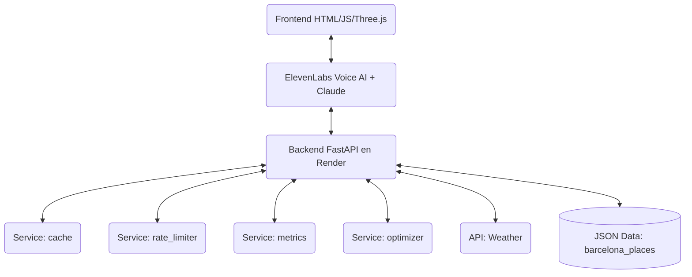
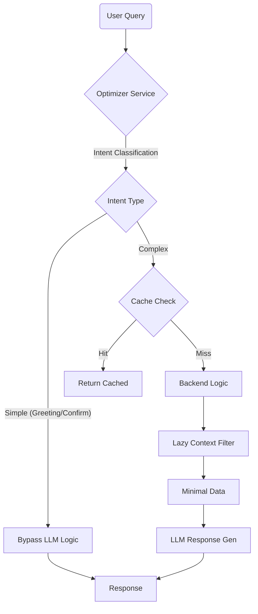

# CONTEXTO DEL PROYECTO: Alexandra Tours

Este documento está optimizado para proporcionar contexto rápido a Modelos de IA (ChatGPT, Claude, etc.) sobre el estado y estructura del proyecto.

## 1. Descripción del Proyecto
**Alexandra Tours** es un asistente turístico de IA hiper-realista accesible vía web (PWA). Actúa como una guía local experta en Barcelona, ofreciendo recomendaciones personalizadas de gastronomía, cultura y ocio.

La visión es crear una experiencia de "lujo accesible" mediante una interfaz de voz fluida (ElevenLabs) y visuales inmersivos (Three.js), integrando en el futuro pagos con Bitcoin (Lightning Network) y autenticación soberana (Nostr). El sistema está diseñado para escalar ("Blindaje Económico") optimizando el uso de tokens LLM.

## 2. Modelo de Negocio
*   **Freemium B2C**:
    *   **Free Tier**: Recomendaciones básicas, límite de 50 requests/día, respuestas concisas.
    *   **Premium Tier**: Acceso ilimitado, itinerarios detallados, reservas, eventos exclusivos.
*   **B2B (Futuro)**: Comisiones por reservas (afiliados) y versiones marca blanca para hoteles.

## 3. Stack Técnico

| Capa | Tecnología | Notas |
| :--- | :--- | :--- |
| **Frontend** | HTML5, CSS3, Vanilla JS | PWA, Three.js para visuales de audio |
| **Voice AI** | ElevenLabs Conv. AI | Widget websocket, Low latency |
| **Backend** | FastAPI (Python 3.11) | Async, REST API |
| **Hosting** | Render (Docker) | Backend deployment |
| **Hosting Front** | Netlify / Render | Frontend estático |
| **LLM** | Claude 3.5 Sonnet | Via ElevenLabs "Brain" |

## 4. URLs de Producción
*   **Backend API Documentation**: `https://alexandra-tours-.onrender.com/docs`
*   **Frontend PWA**: `https://alexandra-tours-.onrender.com/` (Sirviendo estáticos desde backend actualmente)

## 5. Arquitectura y Flujos

### Arquitectura General


### Flujo de Optimización de Tokens (Blindaje Económico)


## 6. Estructura de Carpetas Actual

```text
/
├── backend/
│   ├── api/
│   │   └── routes.py         # Endpoints (Main logic: /tools/city_context)
│   ├── core/
│   │   └── config.py         # App settings
│   ├── data/
│   │   ├── barcelona_places.json # Base de datos local (JSON)
│   │   └── fallback_responses.json
│   ├── services/
│   │   ├── cache.py          # SmartCache con TTL
│   │   ├── rate_limiter.py   # Limites por Tier (Free/Premium)
│   │   ├── metrics.py        # Dashboard de costos e uso
│   │   ├── optimizer.py      # Token saving logic (Intent classification)
│   │   ├── weather.py        # API OpenWeather
│   │   └── places.py
│   └── main.py               # Entry point FastAPI
├── frontend/
│   ├── index.html            # Main UI (Three.js + Logic)
│   └── ...
├── docs/
│   ├── architecture.md
│   └── PROJECT_CONTEXT.md
└── requirements.txt
```

## 7. Estado Actual y Próximos Pasos

**Estado**: `MVP V1.0 - Blindado`
*   ✅ Funcionalidad básica de guía turística implementada.
*   ✅ Interfaz de voz con visualizador de audio activa.
*   ✅ Sistema de "Blindaje Económico" activo (Cache, Rate Limit, Optimizador).
*   ✅ Desplegado en Render.

**Próximos Pasos (Roadmap)**:
1.  **Refinar Prompt**: Mejorar la personalidad de Alexandra en ElevenLabs.
2.  **Base de Datos**: Migrar de JSON a PostgreSQL/Supabase.
3.  **Pagos**: Integrar Lightning Network para upgrade a Premium.
4.  **Autenticación**: Login persistente (actualmente por sessionID anónimo).

## 8. Cómo Correr Localmente

```bash
# Backend
cd backend
# Instalar dependencias
pip install -r ../requirements.txt
# Correr servidor (puerto 8000)
python -m uvicorn backend.main:app --reload --host 0.0.0.0

# Frontend (Servido por FastAPI en / o abrir index.html)
# Acceso móvil vía túnel (reemplazar subdominio si es necesario)
ssh -o StrictHostKeyChecking=no -R 80:localhost:8000 serveo.net
```
