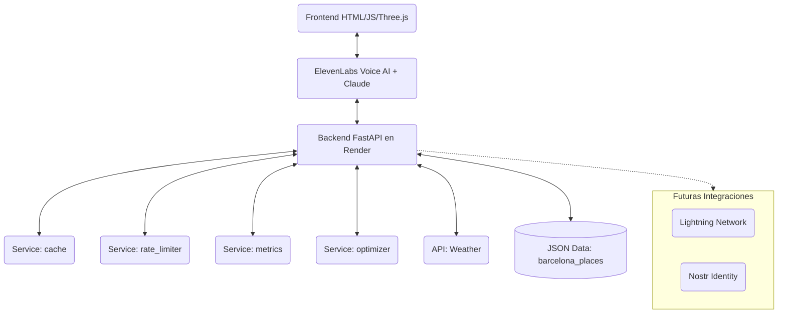
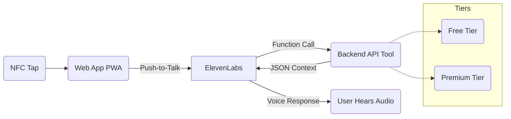
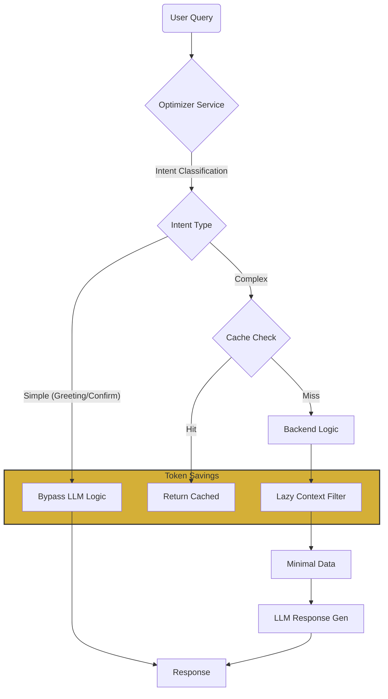
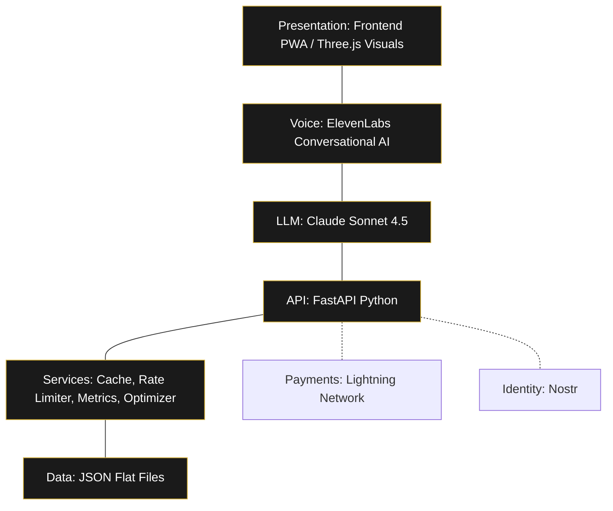

# Arquitectura del Sistema Alexandra Tours

## Arquitectura General

```mermaid
flowchart TB
    Frontend(Frontend HTML/JS/Three.js) <--> ElevenLabs(ElevenLabs Voice AI + Claude)
    ElevenLabs <--> Backend(Backend FastAPI en Render)
    Backend <--> Cache(Service: cache)
    Backend <--> RateLimiter(Service: rate_limiter)
    Backend <--> Metrics(Service: metrics)
    Backend <--> Optimizer(Service: optimizer)
    Backend <--> ExtAPI(API: Weather)
    Backend <--> Data[(JSON Data: barcelona_places)]
    
    subgraph Future [Futuras Integraciones]
        LN(Lightning Network)
        Nostr(Nostr Identity)
    end
    
    Backend -.-> Future
```

## Flujo de Usuario

```mermaid
flowchart LR
    Tap(NFC Tap) --> WebApp(Web App PWA)
    WebApp -- "Push-to-Talk" --> ElevenLabs
    ElevenLabs -- "Function Call" --> BackendTool(Backend API Tool)
    BackendTool -- "JSON Context" --> ElevenLabs
    ElevenLabs -- "Voice Response" --> Response(User Hears Audio)
    
    subgraph Tiers
        Free(Free Tier)
        Premium(Premium Tier)
    end
    
    BackendTool -.-> Free
    BackendTool -.-> Premium
```

## Flujo de Optimización de Tokens

```mermaid
flowchart TD
    Query(User Query) --> Optimizer{Optimizer Service}
    Optimizer -- "Intent Classification" --> Intent{Intent Type}
    
    Intent -- "Simple (Greeting/Confirm)" --> Bypass[Bypass LLM Logic]
    Bypass --> Response
    
    Intent -- "Complex" --> CheckCache{Cache Check}
    CheckCache -- "Hit" --> CachedResponse[Return Cached]
    CheckCache -- "Miss" --> Logic[Backend Logic]
    
    Logic --> Filter[Lazy Context Filter]
    Filter --> Clean[Minimal Data]
    Clean --> LLM[LLM Response Gen]
    LLM --> Response
    
    subgraph Savings [Token Savings]
        Bypass
        CachedResponse
        Filter
    end
    
    style Savings fill:#d4af37,stroke:#333,stroke-width:2px
```

## Stack Completo (Capas)

```mermaid
graph TD
    Presentation[Presentation: Frontend PWA / Three.js Visuals]
    Voice[Voice: ElevenLabs Conversational AI]
    LLM[LLM: Claude Sonnet 4.5]
    API[API: FastAPI Python]
    Services[Services: Cache, Rate Limiter, Metrics, Optimizer]
    Data[Data: JSON Flat Files]
    FuturePay[Payments: Lightning Network]
    FutureId[Identity: Nostr]
    
    Presentation --- Voice
    Voice --- LLM
    LLM --- API
    API --- Services
    Services --- Data
    API -.- FuturePay
    API -.- FutureId
    
    style Presentation fill:#1a1a1a,stroke:#d4af37,color:#fff
    style Voice fill:#1a1a1a,stroke:#d4af37,color:#fff
    style LLM fill:#1a1a1a,stroke:#d4af37,color:#fff
    style API fill:#1a1a1a,stroke:#d4af37,color:#fff
    style Services fill:#1a1a1a,stroke:#d4af37,color:#fff
    style Data fill:#1a1a1a,stroke:#d4af37,color:#fff
```
