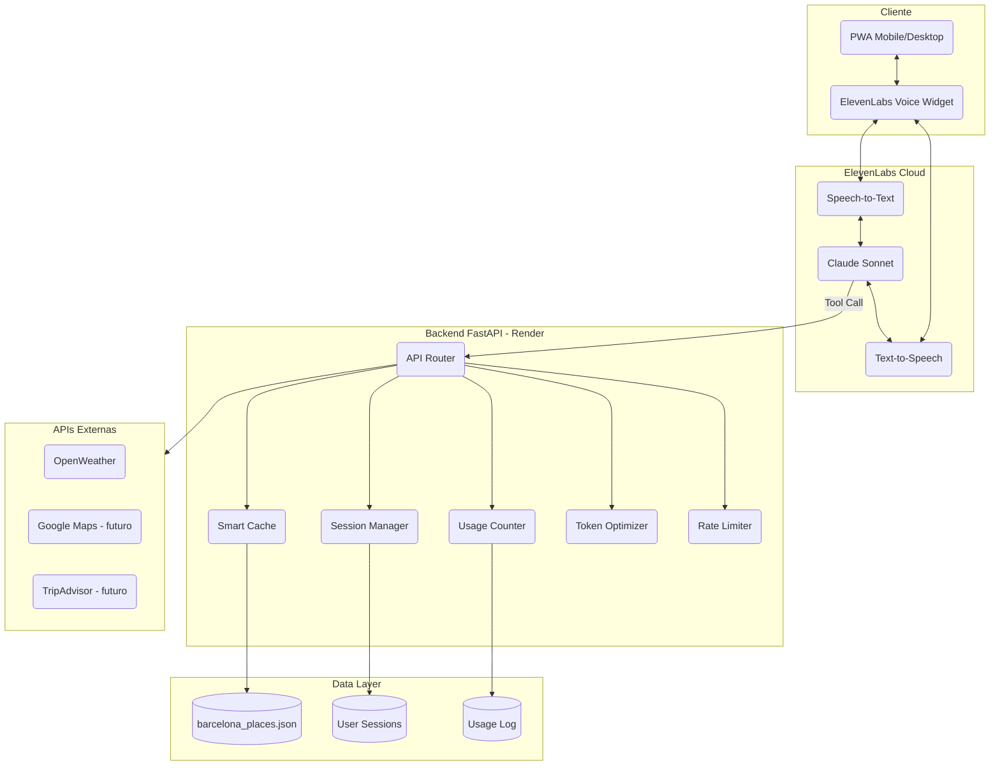
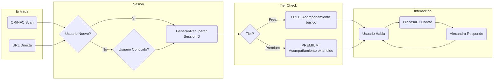
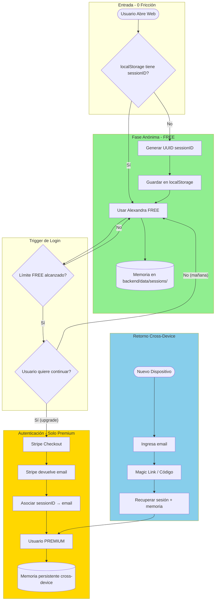
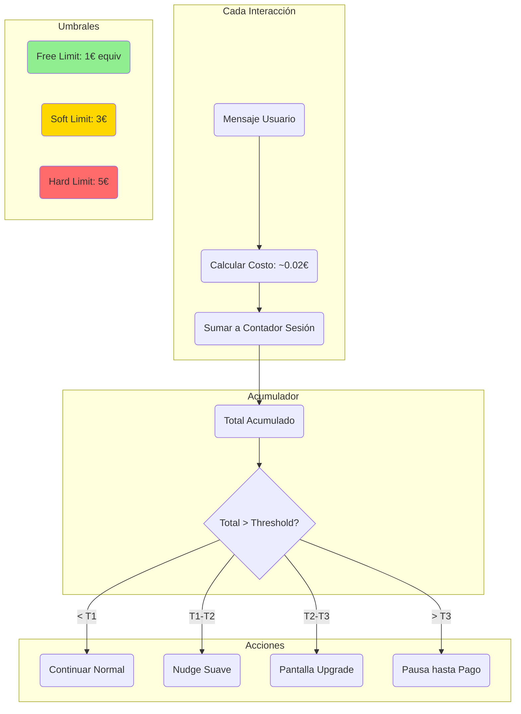
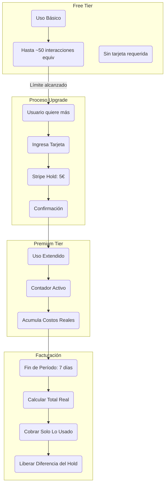
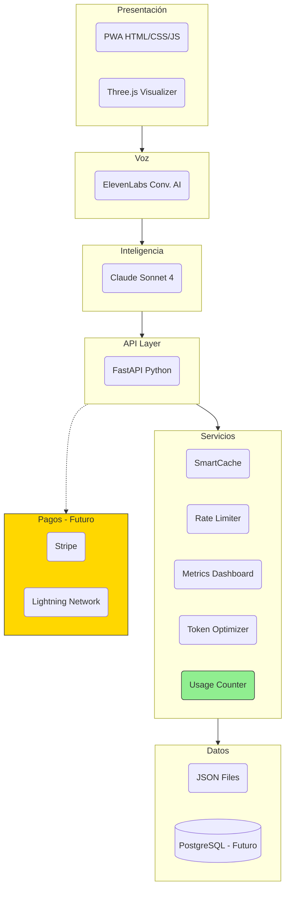
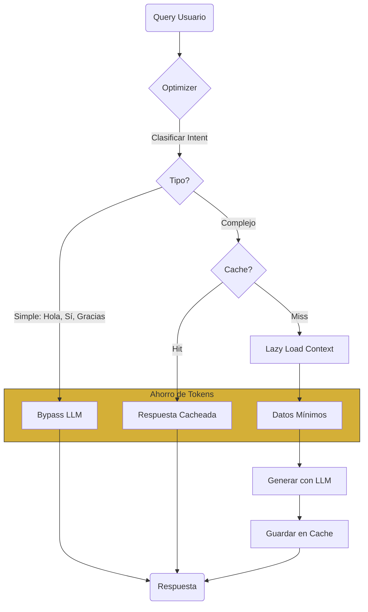
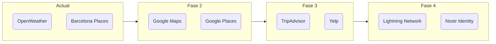

# ARQUITECTURA v2: Alexandra Tours

> Actualizado Enero 2026 - Incluye modelo freemium persistente y sistema de contador

---

## 1. Arquitectura General



---

## 2. Flujo de Usuario Completo



---

## 3. Flujo de Sesión y Autenticación (NUEVO)

**Filosofía: "Primero utilidad, luego identidad"**



### Resumen del Flujo

| Fase | Autenticación | Memoria | Fricción |
|------|---------------|---------|----------|
| **FREE** | Ninguna (localStorage) | Solo ese dispositivo | 0 |
| **PREMIUM** | Email vía Stripe | Cross-device | Mínima (ya paga) |
| **RETORNO** | Magic link a email | Recupera todo | Baja |

### Implementación

**Frontend (localStorage):**
```javascript
// Al cargar la app
let sessionId = localStorage.getItem('alexandra_session');
if (!sessionId) {
    sessionId = crypto.randomUUID();
    localStorage.setItem('alexandra_session', sessionId);
}
// Usar sessionId en todas las llamadas API
```

**Backend (asociar email en upgrade):**
```python
@router.post("/api/upgrade/complete")
async def complete_upgrade(session_id: str, stripe_session: str):
    # Stripe devuelve email del cliente
    customer_email = get_stripe_customer_email(stripe_session)

    # Asociar sessionID con email
    session = load_session(session_id)
    session.email = customer_email
    session.tier = "premium"
    save_session(session)

    # Crear índice email → session_id para recuperación
    save_email_index(customer_email, session_id)
```

**Recuperación cross-device:**
```python
@router.post("/api/session/recover")
async def recover_session(email: str):
    # Buscar session por email
    session_id = get_session_by_email(email)
    if session_id:
        # Enviar magic link o código
        send_magic_link(email, session_id)
        return {"status": "link_sent"}
    return {"status": "not_found"}
```

---

## 4. Sistema de Contador Acumulativo



---

## 4. Modelo de Monetización (Stripe)



**Ejemplo:**
- Stripe retiene 10€
- Usuario consume 3.20€ en 7 días
- Se cobra 3.20€, se liberan 6.80€

**Por qué 10€:** Cubre hasta ~500 interacciones/semana (uso extremo). Turista en Barcelona gasta 100-300€/día, 10€ es imperceptible.

---

## 5. Stack por Capas



---

## 6. Flujo de Optimización de Tokens



---

## 7. Endpoints Principales

| Endpoint | Método | Descripción |
|----------|--------|-------------|
| `/api/tools/city_context` | POST | Tool principal para ElevenLabs |
| `/api/session` | GET | Obtener/crear sesión |
| `/api/usage` | GET | Consultar uso acumulado |
| `/api/upgrade` | POST | Iniciar proceso upgrade |
| `/health` | GET | Health check |

---

## 8. Variables de Entorno

```env
# ElevenLabs
ELEVENLABS_API_KEY=xxx
ELEVENLABS_AGENT_ID=xxx

# OpenWeather
OPENWEATHER_API_KEY=xxx

# Stripe (Futuro)
STRIPE_SECRET_KEY=xxx
STRIPE_WEBHOOK_SECRET=xxx

# Config
ENVIRONMENT=production
FREE_TIER_LIMIT=50
PREMIUM_HOLD_AMOUNT=500  # céntimos
BILLING_PERIOD_DAYS=7
```

---

## 9. Decisiones de Arquitectura

| Decisión | Razón |
|----------|-------|
| Freemium persistente | Evita presión artificial, construye confianza |
| Contador acumulativo | Permite microtransacciones sin comisiones por mensaje |
| Stripe hold | Usuario no siente "cada mensaje cuesta", paga al final |
| Cache agresivo | Reduce costos LLM 40-60% |
| Token optimizer | Bypass para intents simples |

---

## 10. Futuras Integraciones


